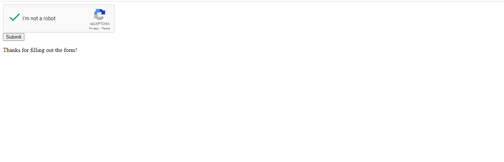

# How to use google re-CAPTCHA in Python Flask Project
1. Open this url: https://www.google.com/recaptcha/admin/create 
2. Set re-CAPTCHA type v2 or v3
3. Accept the reCAPTCHA Terms of Service
4. Set domain to 127.0.0.1
5. Generate public and private key for re-CAPTCHA api
6. Send alerts to owner and save.

# Clone this project
	git clone https://github.com/AhsanRiaz9/how-to-use-recaptcha-in-flask

## Requirements:
	flask
	Flask-reCaptcha

## Note: 
Open the app.py and replace the public and private api key with your keys.

## Run the project:
	python app.py

## Output will be look like this:

### Thanks for viewing my repo. 
#### Don't forget to follow me and fork the repo.  

 